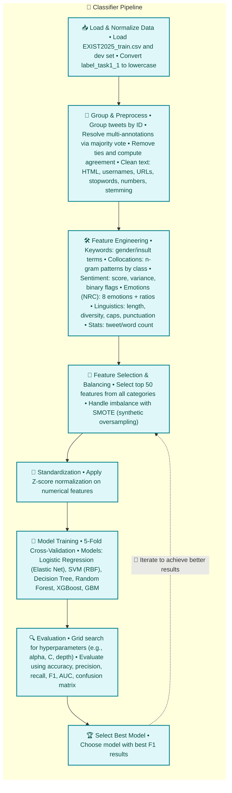

```mermaid 
flowchart LR
 subgraph c1["🤖 Classifier Pipeline"]
        A["📥 Load & Normalize Data • Load EXIST2025_train.csv and dev set • Convert label_task1_1 to lowercase"]
        B["🧾 Group & Preprocess • Group tweets by ID • Resolve multi-annotations via majority vote • Remove ties and compute agreement • Clean text: HTML, usernames, URLs, stopwords, numbers, stemming"]
        C["🛠️ Feature Engineering • Keywords: gender/insult terms • Collocations: n-gram patterns by class • Sentiment: score, variance, binary flags • Emotions (NRC): 8 emotions + ratios • Linguistics: length, diversity, caps, punctuation • Stats: tweet/word count"]
        D["🎯 Feature Selection & Balancing • Select top 50 features from all categories • Handle imbalance with SMOTE (synthetic oversampling)"]
        E["📐 Standardization • Apply Z-score normalization on numerical features"]
        F["🤖 Model Training • 5-Fold Cross-Validation • Models: Logistic Regression (Elastic Net), SVM (RBF), Decision Tree, Random Forest, XGBoost, GBM"]
        G["🔍 Evaluation • Grid search for hyperparameters (e.g., alpha, C, depth) • Evaluate using accuracy, precision, recall, F1, AUC, confusion matrix"]
        H["🏆 Select Best Model • Choose model with best F1 results"]
  end
    A --> B
    B --> C
    C --> D
    D --> E
    E --> F
    F --> G
    G --> H
    H -. 🔁 Iterate to achieve better results .-> D
     A:::container
     B:::container
     C:::container
     D:::container
     E:::container
     F:::container
     G:::container
     H:::container
    classDef container fill:#e0f7fa,stroke:#00838f,color:#004d40,stroke-width:2px
    classDef boundary fill:#ffffff,stroke:#006064,stroke-width:3px,stroke-dasharray:5 5,color:#000000
    style c1 stroke:none


```
