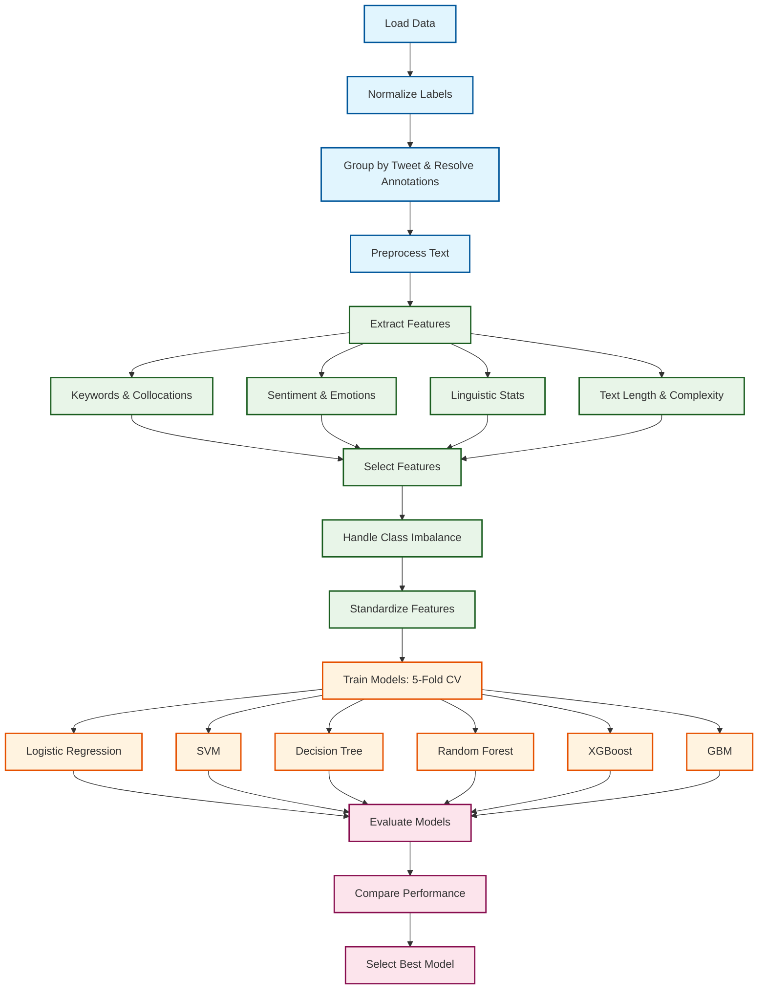

```mermaid 
flowchart TD
    %% Data Loading & Preprocessing
    A[Load Data] --> B[Normalize Labels]
    B --> C[Group by Tweet & Resolve Annotations]
    C --> D[Preprocess Text]

    %% Feature Engineering
    D --> E[Extract Features]
    E --> E1[Keywords & Collocations]
    E --> E2[Sentiment & Emotions]
    E --> E3[Linguistic Stats]
    E --> E4[Text Length & Complexity]

    %% Feature Selection & Balancing
    E1 --> F[Select Features]
    E2 --> F
    E3 --> F
    E4 --> F
    F --> G[Handle Class Imbalance]
    G --> H[Standardize Features]

    %% Model Training
    H --> I[Train Models: 5-Fold CV]
    I --> I1[Logistic Regression]
    I --> I2[SVM]
    I --> I3[Decision Tree]
    I --> I4[Random Forest]
    I --> I5[XGBoost]
    I --> I6[GBM]

    %% Evaluation & Selection
    I1 --> J[Evaluate Models]
    I2 --> J
    I3 --> J
    I4 --> J
    I5 --> J
    I6 --> J
    J --> K[Compare Performance]
    K --> L[Select Best Model]

    %% Styling
    classDef dataNode fill:#e1f5fe,stroke:#01579b,stroke-width:2px
    classDef processNode fill:#f3e5f5,stroke:#4a148c,stroke-width:2px
    classDef featureNode fill:#e8f5e8,stroke:#1b5e20,stroke-width:2px
    classDef modelNode fill:#fff3e0,stroke:#e65100,stroke-width:2px
    classDef evalNode fill:#fce4ec,stroke:#880e4f,stroke-width:2px

    class A,B,C,D dataNode
    class E,E1,E2,E3,E4,F,G,H featureNode
    class I,I1,I2,I3,I4,I5,I6 modelNode
    class J,K,L evalNode


```